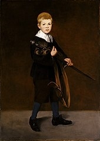

# 背景

## 印象派 1860 - ...

ref
- https://artsandculture.google.com/entity/impressionism/m03xj1?categoryid=art-movement

- 莫奈 印象日出

印象派使用的是可见的小而薄的笔触，主要是关于普通的物体。它有开放的构图和不同寻常的视角，它描述了随着时间的推移而变化的光的质量，并将运动作为一个必要的元素。它更强调色彩而不是线条，并描绘了真实的场景，且要在户外作画。它包括坦率的姿势，动作，和使用不同的颜色。它捕捉了主体的内核和特点。

印象派避免使用底漆，通过尽可能少地混合颜色，并在未干的颜料上涂抹颜料，实现了柔和的边缘和令人兴奋的色彩混合。印象派画作的表面是不透明的。 作者：LCKpresent https://www.bilibili.com/read/cv12604605?from=search 出处：bilibili

一幅印象派画作通常看起来就像一张快照，仿佛它是偶然捕捉到的。这被认为是受到了照片和日本艺术日益流行的影响。印象派为新印象派、野兽派、立体派和后印象派铺平了道路。 作者：LCKpresent https://www.bilibili.com/read/cv12604605?from=search 出处：bilibili

## 后意象派 1886 - 1905

ref
- https://artsandculture.google.com/entity/post-impressionism/m015xrq?categoryid=art-movement

后印象主义是以印象主义的形式发展起来的，用来指文森特·梵高、保罗·高更、乔治·修拉等年轻人的作品。后印象派画家仍然使用鲜艳的色彩、厚重的颜料、独特的笔触和普通的主题，但强调使用几何形式和不自然的颜色。 作者：LCKpresent https://www.bilibili.com/read/cv12604605?from=search 出处：bilibili

后印象派画家探索了不同的绘画方向和方法，而不关心他们的对象的外观。它为现代艺术的发展铺平了道路，而现代艺术很大程度上是基于个体艺术家的情感和概念。印象主义是在户外完成的，而后印象主义是在画室里完成的。这是一个较慢的过程，涉及有条理的过程。 作者：LCKpresent https://www.bilibili.com/read/cv12604605?from=search 出处：bilibili

## 新印象派
关于新印象派，其实是比较好区分的。新印象派又叫点彩派，最大的特点就是他的点彩画法。关于新印象派，其实是比较好区分的。新印象派又叫点彩派，最大的特点就是他的点彩画法。

## 沙龙
https://zhuanlan.zhihu.com/p/36657405?utm_id=0

# 方位
二楼左侧
- 801～830

# 人物
- 印象派
    - 卡米耶·毕沙罗（Camille Pissarro 1830年7月10日－1903年11月13日），是一位丹麦裔法国的印象派、新印象派画家。毕沙罗喜好写生，画了相当多的风景画，他的后期作品是印象派中点彩画派的佳作，此外，毕沙罗的人像画也有他特殊的风格。毕沙罗是唯一一个参加了印象派所有8次展览的画家
        - 820 (some 817)
        - 时间线
            - ~1859 早期
                - 学院派
                - 上过沙龙
            - ~1870 法国期间
                - 印象派
                - 落选者沙龙 （1863）
                    - 莫奈、阿尔芒德·基约曼和塞尚， 库尔贝、马奈、毕沙罗
                - 多数画作毁于普法战争
            - 1874 年
                - 印象派 展
                    - 塞尚
            - 1880 年代
                - 尝试不同的风格
                - 点拨过梵高
            - 1885 年
                - 新印象派
                    - 短暂
    - 埃德厄尔·马奈（Édouard Manet, 1832-1883）：常被视为现实主义与印象派之间的桥梁，马奈以其创新的绘画方法和对现代生活的描绘而著称。（《草地上的午餐》不在 met）
        - 810， 817， 820
        - 时间线
            - ~1856
                - 求学，旅行各国
            - ~1860
                - 开工作室
                - 画现实主义画
                - 细节松散
            - 1860 年代
                - 不重视细节
                - 运用光线
                - 1868 摩里索 说服马奈尝试"室外画" (En plein air)
        - 作品
            - 《男孩拿剑》
    - 克劳德·莫奈（Claude Monet, 1840-1926）：印象派运动的奠基人之一，莫奈以其精湛的色彩、光线和氛围运用而闻名。他的户外绘画（en plein air）创新方法彻底改变了艺术世界。
        - 818, 819, some 821
        - 时间线
            - 1862 在画室创建印象派
            - 1879 年第一任妻去世
            - 1892 年娶第二任妻是金主的老婆
            - 1883 定居，开始
            - 1923年，由于在白内障影响下他的画作整体偏红，莫奈决定接受两次白内障手术，以减小白内障症状对其视力的影响。也许如此，他在手术过后可以看见某些常人难以看见的紫外线，影响他观察到的颜色。在手术后，他甚至重新绘制了部分作品，当中的睡莲更蓝了。
        - misc
            - 日出印象 1872
    - 皮埃尔·奥古斯特·雷诺阿（Pierre-Auguste Renoir, 1841-1919）：一位杰出的印象派艺术家，以其明亮的色彩调和捕捉日常生活之美与感性而著称。
        - 824， 821
        - 时期
            - 1864 出席沙龙
            - 1870 出席落选者沙龙
            - 1892 患关节炎
            - 1919 去世
        - misc
            - 莫奈的画室同学
            - 工人阶级出身比较穷
            - 为理查德瓦格纳绘画肖像
            - 雷诺阿有三个儿子，其中尚·雷诺阿成为电影导演，而皮埃尔成为了舞台剧和电影演员。
            - 晚年的模特 Tilla Durieux 是个当时的女演员
    - 埃德加·德加（Edgar Degas, 1834-1917）：印象派运动的关键人物之一，以其绘画、粉画和雕塑描绘芭蕾舞者和其他现代生活场景而闻名。
    - 阿尔弗雷德·西斯莱（Alfred Sisley, 1839-1899）：印象派画家，以其对自然光线和空气感觉的捕捉而著称，尤其是在法国乡村风景中。
- 后印象派
    - 保罗·塞尚（Paul Cézanne, 1839-1906）：一位后印象派艺术家，他对形式和色彩的创新处理为现代艺术的发展奠定了基础。塞尚认为“线是不存在的，明暗也不存在，只存在色彩之间的对比。物象的体积是从色调准确的相互关系中表现出来。”塞尚认为：“画画并不意味着盲目地去复制现实，它意味着寻求各种关系的和谐。”
        - 823 826
        - 时间线
            - 1882 唯一一次参加沙龙 （从1863 年一直落选）
                - Portrait of Louis-Auguste Cézanne, Father of the Artist, reading 'l'Evénement', 在 DC
            - 1906 年死于肺炎（殉职）
        - 作品
            - 《维克多山》826
        - misc
            - 天主教徒
                - 认为画神造物也是艺术
            - 银行老板儿子
            - 毕沙罗的学生

    - 文森特·梵高（Vincent van Gogh, 1853-1890）：一位以大胆色彩和富有表现力的笔触闻名的后印象派画家。梵高的作品因其情感强烈而持续吸引观众。
        - 时间线
            - 1880~1881 在艺术学院学习基本绘画知识
            - 1882年6月画了第一幅油画1
            - 1884年开始在乡间作画
                - 1885年展出 《吃土豆的人》
            - 1886年回巴黎
                - 短暂就学于 费尔南德·柯罗蒙 画室
                    - 同学有马蒂斯和徐悲鸿
                - 喜欢塞上和阿道夫·蒙蒂塞利
                - 开始收集浮世绘
            - 1886年年末 认识了保罗·西涅克
                - 并尝试了散点画
            - 1887年认识了高更
            - 1888年2月去了阿尔勒
                - 画了向日葵
                - 8月和高更同住
                - 割耳朵
            - 1889~1890
                - 住在精神病院
                    - 凭回忆完成了作品
                    - 修改了一些作品
            - 1890
                - 作品参展，得到莫奈肯定
            - 1890
                - 麦田的乌鸦
                - 自杀身亡
        - 作品
            - 822 Wheat Field with Cypresses 1889
            - 822 shoes
    - 保罗·高更（Paul Gauguin, 1848-1903）：一位后印象派艺术家，以大胆的色彩运用和对非欧洲社会的精神与文化探索而闻名，尤其是在大溪地。
    - 亨利·德·土鲁斯-洛特雷克（Henri de Toulouse-Lautrec, 1864-1901）：一位后印象派艺术家，以描绘巴黎夜生活，尤其是蒙马特的卡巴莱和舞厅的波西米亚氛围而著称。

- 新印象派
    - 乔治·修拉（Georges Seurat, 1859-1891）：一位后印象派艺术家，以其创新的点彩画技法而闻名，该技法使用小色点来创作一个统一的图像。
    - 保罗·西涅克

# 作品
- 德加的芭蕾舞者
- 莫奈，《花园》
- 莫奈《谷堆》
- 鲁本斯
- 梵高的《向日葵》
- 梵高的旧鞋子
- 大碗岛星期天的下午 乔治 修拉

# reading
- https://www.zhihu.com/question/21003620
